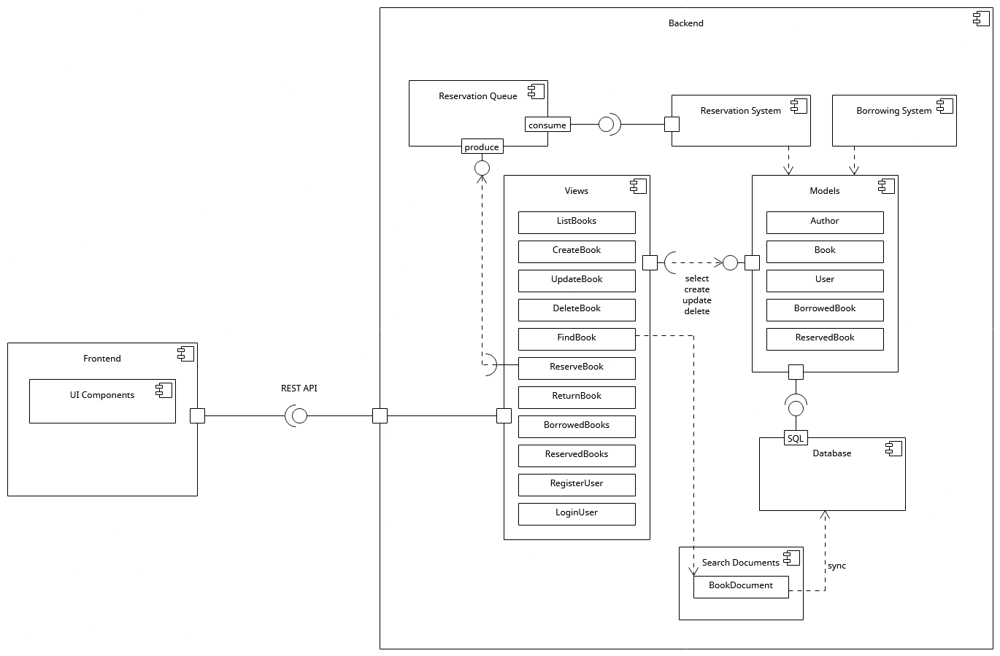
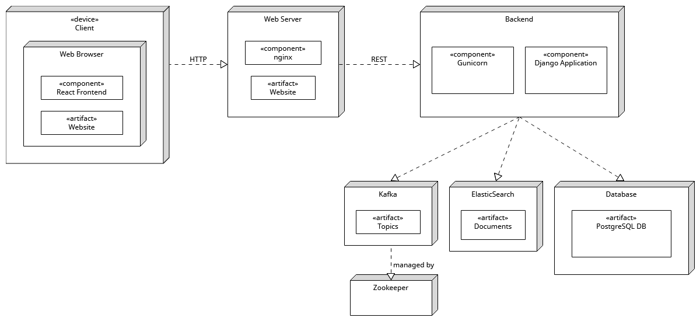

# Library management system

## 🚀 About

**Library management system** is an app built with a Django backend and a React frontend. It is designed to streamline the process of managing books, users, and their interactions with the library.

## 📝 How to Build

Clone this repository: \
`git clone https://github.com/mbo009/library-management-system/tree/main && cd library-management-system`
Ensure the docker engine is running on your machine. Then simply: \
`docker compose up`

## 🏗️ Architecture

### Components

### Deployment

## ⚙️ Based on

- [Python](https://docs.python.org/)
- [Django](https://docs.djangoproject.com/)
- [Typescript](https://www.typescriptlang.org/docs/)
- [React](https://react.dev/)
- [Docker](https://docs.docker.com/)
- [Kubernetes](https://kubernetes.io/docs/)
- [Elasticsearch](https://www.elastic.co/guide/index.html)
- [Kafka](https://kafka.apache.org/documentation/)
